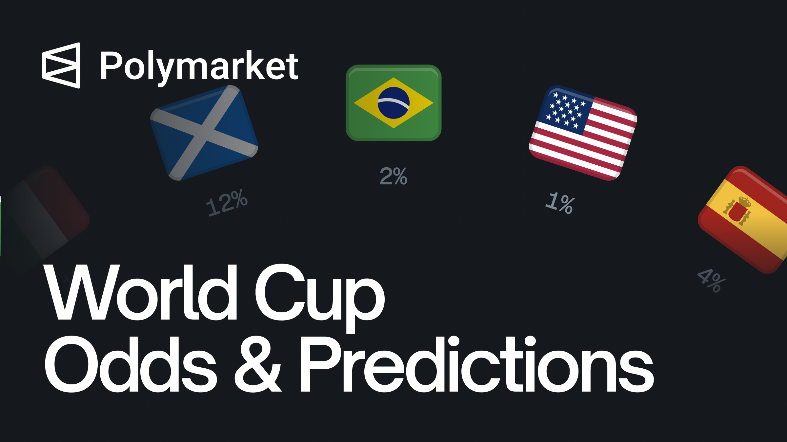
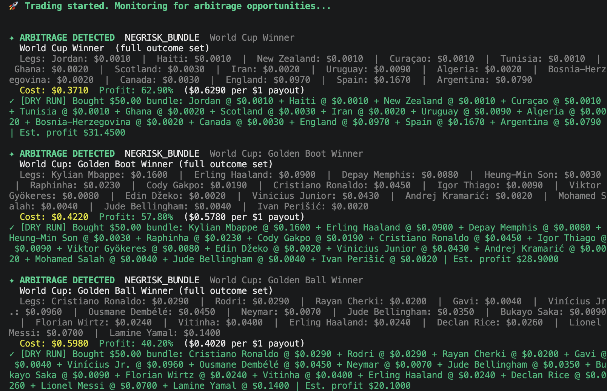

# World Cup Arbitrage Trading Bot

A professional CLI trading bot for **Polymarket FIFA World Cup 2026** markets. It discovers World Cup events, shows live market state on startup, and continuously scans for arbitrage opportunities.

## Features

- **WORLD CUP** branded terminal UI with live market tables
- **Real Polymarket data** via Gamma API (discovery) + CLOB API (live prices)
- **Arbitrage strategies**
  - Binary YES+NO bundle: buy both sides when total cost < $1.00
  - Neg-risk bundles: buy all outcome YES tokens when combined cost < $1.00
- **Configurable settings after trading starts** — change edge, position size, scan interval, and more without restarting
- **Dry-run mode** by default (safe simulation)
- **Redis caching** (optional) — persist settings, markets, stats, and market state

## Prerequisites

- Node.js 18+
- npm

## Quick Start

### Clone Repo

```bash
git clone https://github.com/thombanal/polymarket-fifa-arbitrage
cd polymarket-fifa-arbitrage
```

### Settings

```bash
cp .env.example .env
```

### Configuration .env file

```bash
# Trading mode: “dry_run” refers to a simulation, while “live” refers to live trading
TRADING_MODE=dry_run

# Wallet (required for live trading with @polymarket/clob-client)
# Export from wallets such as MetaMask, Private keys begin with 0x:
PRIVATE_KEY=0x
# The address listed in your Polymarket profile
DEPOSIT_WALLET_ADDRESS=

# Polymarket API credentials (optional — derived from PRIVATE_KEY if empty)
# https://polymarket.com/settings?tab=builder - Click “+ Create New”
POLY_API_KEY=
POLY_API_SECRET=
POLY_API_PASSPHRASE=

# Default arbitrage settings (can be changed in CLI after start)
MIN_EDGE=0.01
MAX_POSITION_USD=50
SCAN_INTERVAL_MS=5000
MIN_LIQUIDITY_USD=10000
MAX_MARKETS=30

# Redis (optional — caches settings, markets, stats)
# You don't need to configure this
REDIS_ENABLED=false
REDIS_URL=
REDIS_HOST=127.0.0.1
REDIS_PORT=6379
REDIS_USERNAME=
REDIS_PASSWORD=
REDIS_DB=0
REDIS_KEY_PREFIX=workdcup:
REDIS_MARKETS_TTL_SEC=300
REDIS_STATE_TTL_SEC=120
```


### Install

```bash
npm install
```

### Run

```bash
npm start
```

The bot will:

1. Show the **WORLD CUP** banner
2. Load World Cup markets from Polymarket
3. Display **current market state** (YES/NO prices, sums, liquidity)
4. Start scanning for arbitrage opportunities



## CLI Commands

While the bot is running, type commands and press Enter:

| Command | Description |
|---------|-------------|
| `settings` | Open interactive arbitrage settings (change anytime) |
| `status` | Show bot stats and current settings |
| `markets` | Refresh and display market state |
| `pause` | Pause scanning |
| `resume` | Resume scanning |
| `help` | Show command list |
| `quit` | Exit the bot |

## Arbitrage Settings

Configure via `.env` or the in-app `settings` command:

| Setting | Default | Description |
|---------|---------|-------------|
| `TRADING_MODE` | `dry_run` | `dry_run` or `live` |
| `MIN_EDGE` | `0.01` | Minimum profit edge (1%) |
| `MAX_POSITION_USD` | `50` | Max USD per trade |
| `SCAN_INTERVAL_MS` | `5000` | Scan frequency |
| `MIN_LIQUIDITY_USD` | `10000` | Minimum market liquidity |
| `MAX_MARKETS` | `30` | Markets per event to scan |


## Redis (Optional)

Enable Redis to cache market discovery, persist arbitrage settings across restarts, and store bot stats:

```bash
REDIS_ENABLED=true
REDIS_URL=redis://127.0.0.1:6379
```

If Redis is unavailable, the bot continues without cache. Use the `markets` command to force a fresh API refresh.

## Live Trading

- Set `TRADING_MODE=live` in `.env`

> **Note:** Polymarket has geographic restrictions. Ensure you comply with their terms of service.

## How Arbitrage Works

On Polymarket binary markets, YES + NO tokens always pay out exactly $1.00 combined at resolution. If you can buy both for less than $1.00 (minus fees), you lock in risk-free profit.

For neg-risk multi-outcome events (e.g. **World Cup Winner**), buying YES on every outcome has the same property when the full set costs less than $1.00.

## Project Structure

```
src/
├── index.ts              # Entry point
├── config.ts             # Environment settings
├── types.ts              # Type definitions
├── api/
│   ├── gamma.ts          # Market discovery
│   └── clob.ts           # Live prices
├── arbitrage/
│   ├── scanner.ts        # Opportunity detection
│   └── executor.ts       # Trade execution
└── cli/
    ├── app.ts            # Main CLI application
    ├── banner.ts         # WORLD CUP display
    ├── display.ts        # Tables and output
    └── settings-menu.ts  # Interactive settings
```

## License

[MIT](LINCENSE)

## Tip me:
EVM:  `0x63259a528b9186992e55b265b2bd05eee8df64e1`
SOL: `7GtsKuSsM3hP3MGZoryvYqUGnsw7W4Lw3Pbui45mU65V`